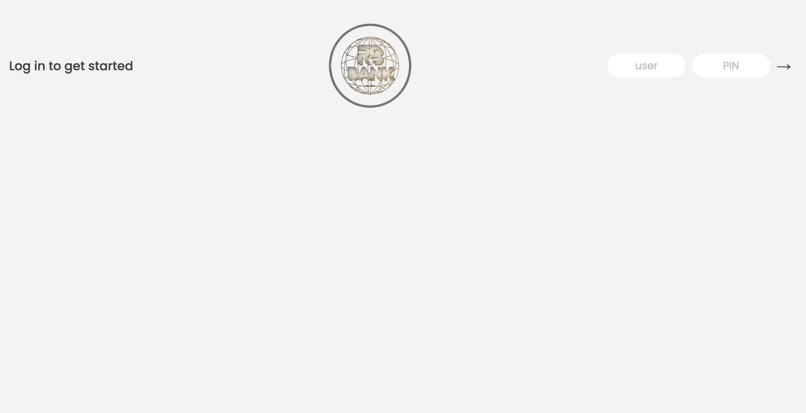
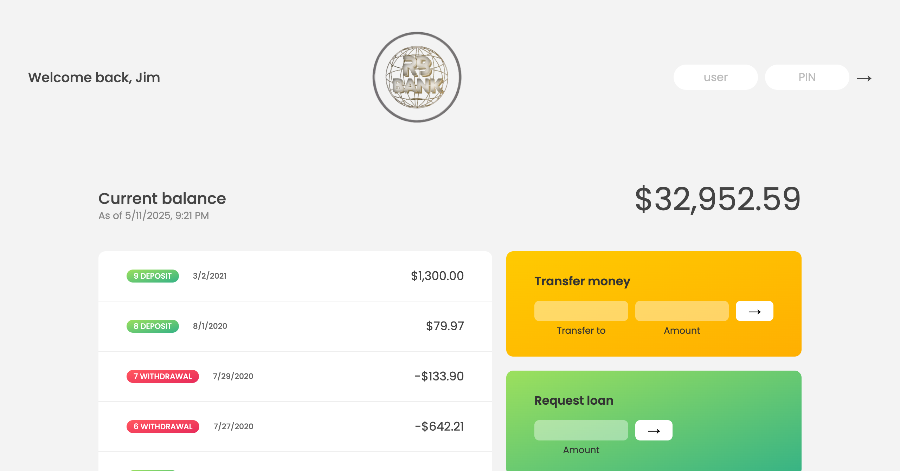
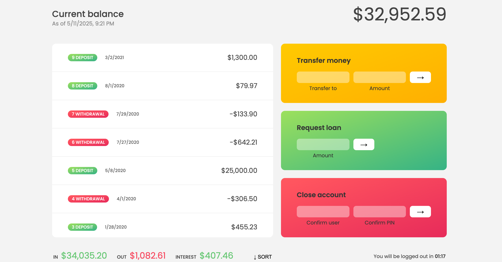

# RB Bank - Online Banking System

RB Bank is a simple online banking system built using HTML, CSS, and JavaScript. The project is designed to simulate a basic banking experience where users can log in, view their account balance, make transfers, request loans, and close their account.

## Preview Screenshots

### 🔓 Login Page


### 🏦 Dashboard


### 🔄 Transfer Money



## Features

- **User Authentication:** Users can log in with their username and PIN.
- **Balance Overview:** Displays the current balance of the user’s account.
- **Transaction History:** Displays all movements (deposits and withdrawals) with dates.
- **Transfer Money:** Users can transfer money to another account.
- **Request Loan:** Users can request a loan if they have made sufficient deposits.
- **Account Closure:** Users can close their account by confirming their username and PIN.
- **LogOut Timer:** Automatically logs out the user after 5 minutes of inactivity.

## Technologies Used

- **HTML5**: Structure of the webpage.
- **CSS3**: Styling for the webpage.
- **JavaScript**: Logic for handling user interactions, including account functionality, transactions, and UI updates.

## Getting Started

### Prerequisites

No special prerequisites are required to run this project. You can run it directly in your browser.

### Installation

1. Clone the repository:
   ```bash
   git clone https://github.com/yourusername/rb-bank.git

2. Open the project folder in your code editor.

3. Open the index.html file in your browser to view the app.

# File Structure

/RB-BANK
│
├── /public
│   ├── index.html        # Main HTML file containing the structure of the web page
│   ├── style.css         # CSS file for styling and layout design
│   ├── script.js         # JavaScript file for functionality (account handling transactions, etc.)
│   └── /image            # Folder containing images (logos, icons, etc.)
│
├── .gitignore            # Specifies files and folders to be ignored by Git
└── README.md             # Project documentation


# How It Works

1. Login: Users must input their username and PIN to access their account. Once logged in, the app will display the balance, transaction history, and allow the user to make transfers and request loans.

2. Making Transfers: Users can transfer funds to another account. The app ensures that the user has enough balance and prevents transfers to their own account.

3. Requesting a Loan: Users can request a loan by inputting an amount. The loan request is only granted if the user has made deposits that exceed 10% of the requested loan amount.

4. Account Closure: Users can close their account by entering their username and PIN to confirm the closure.

5. Session Timeout: The app will log the user out after 5 minutes of inactivity, showing a countdown timer until logout.

# Contributing

If you want to contribute to this project, feel free to fork it, make changes, and submit a pull request. All contributions are welcome!

# Author
 <RB> RB GROUP COMPANY</RB>