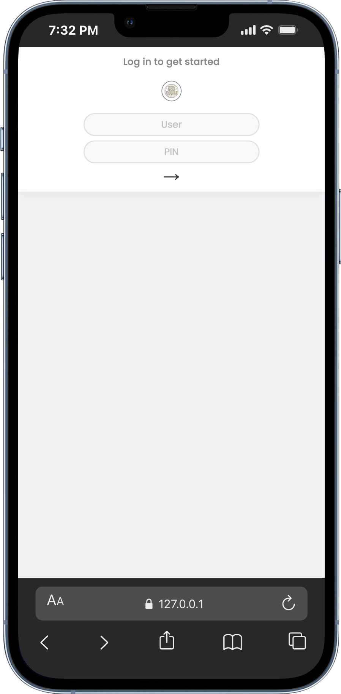
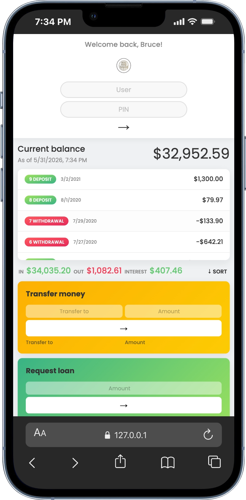
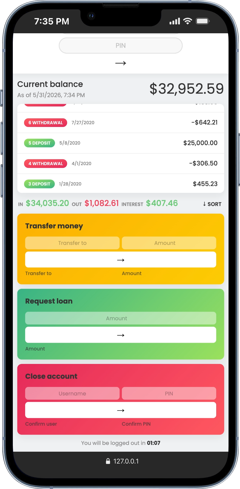

<div align="center">

# 🏦 RB BANK


### Modern Online Banking Application


<br>

A fully responsive online banking application built with **HTML5**, **CSS3**, and **Vanilla JavaScript**.

RB BANK simulates a modern digital banking experience where users can securely manage accounts, transfer funds, request loans, monitor transactions, and maintain session security through automatic logout functionality.

Designed to showcase modern JavaScript development, responsive web design, and real-world financial application workflows.

</div>

---

# 🌐 Live Demo

```text
https://yourusername.github.io/RB_BANK/
```

> Replace the URL above with your GitHub Pages deployment link.

---

# 📸 Desktop Preview

## 🔐 Login Page

<p align="center">
  
</p>

---

## 💳 Banking Dashboard

<p align="center">
  
</p>

---

## 💸 Transfer & Account Operations

<p align="center">
  
</p>

---

# 📱 Mobile Responsive Design

<div align="center">





</div>

---

# ✨ Features

## 🔑 Secure Authentication

* Login using Username and PIN
* User validation and authentication
* Personalized welcome message
* Protected banking dashboard

---

## 💰 Account Dashboard

* Real-time balance calculations
* Dynamic account overview
* Currency formatting using Intl API
* Localized date and time display

---

## 📊 Transaction Management

* Deposit tracking
* Withdrawal tracking
* Transaction history
* Automatic date formatting
* Relative transaction dates

Examples:

* Today
* Yesterday
* 3 Days Ago
* Localized Full Dates

---

## 💸 Money Transfer System

Transfer money between registered accounts with built-in validation:

* Positive transfer amount
* Existing recipient verification
* Sufficient account balance
* Self-transfer prevention

---

## 🏦 Loan Request System

Loan requests are approved only when:

```text
At least one deposit is equal to or greater than
10% of the requested loan amount.
```

Features:

* Eligibility verification
* Simulated bank processing delay
* Automatic UI updates
* Transaction recording

---

## 🔍 Transaction Filters

Filter transactions by:

* All Transactions
* Deposits Only
* Withdrawals Only

---

## ↕️ Transaction Sorting

* Dynamic transaction sorting
* Ascending movement ordering
* Instant UI updates

---

## ❌ Account Closure

Secure account deletion with:

* Username verification
* PIN confirmation
* Immediate account removal

---

## ⏱️ Automatic Logout Timer

* 5-minute inactivity timer
* Countdown display
* Session security
* Auto logout protection
* Timer reset after user actions

---

## 💾 Local Storage Persistence

All account updates are stored locally in the browser.

Includes:

* Transfers
* Loans
* Balance updates
* Account deletion
* Transaction history

---

## 📱 Fully Responsive Design

Optimized for:

* Desktop Computers
* Laptops
* Tablets
* Mobile Phones
* Small Screen Devices

---

# 🛠️ Technologies Used

## Frontend

* HTML5
* CSS3
* JavaScript (ES6+)

## Layout & Styling

* CSS Grid
* Flexbox
* Media Queries
* Responsive Design
* CSS Variables

## JavaScript APIs

* LocalStorage API
* Intl.NumberFormat API
* Intl.DateTimeFormat API
* Date API
* DOM API

---

# 🧠 JavaScript Concepts Practiced

## DOM Manipulation

```javascript
querySelector()
textContent
insertAdjacentHTML()
classList
```

---

## Event Handling

```javascript
click events
form submissions
user interactions
```

---

## Array Methods

```javascript
map()
filter()
reduce()
find()
findIndex()
some()
sort()
forEach()
```

---

## Local Storage

```javascript
localStorage.getItem()
localStorage.setItem()
JSON.parse()
JSON.stringify()
```

---

## Date & Time Operations

```javascript
Date Object
ISO Date Strings
Relative Date Calculations
```

---

## Internationalization

```javascript
Intl.NumberFormat()
Intl.DateTimeFormat()
```

---

## Application State Management

```javascript
User Session Handling
Account Data Updates
Dynamic UI Rendering
```

---

# 📂 Project Structure

```text
RB_BANK
│
├── public
│   │
│   ├── index.html
│   ├── style.css
│   ├── script.js
│   │
│   └── image
│       │
│       ├── RB_BANKpng-black.png
│       ├── Screenshot1.png
│       ├── Screenshot2.png
│       ├── Screenshot3.png
│       ├── mobile-view-1.png
│       ├── mobile-view-2.png
│       └── mobile-view-3.png
│
├── .gitignore
└── README.md
```

---

# 🎯 Demo Accounts

## Account #1

```text
Username: bw
PIN: 1111
```

---

## Account #2

```text
Username: bb
PIN: 2222
```

---

# ⚙️ Installation

## Clone Repository

```bash
git clone https://github.com/your-username/RB_BANK.git
```

---

## Navigate into Project Directory

```bash
cd RB_BANK
```

---

## Run the Application

Open:

```bash
public/index.html
```

or launch with:

```bash
Live Server
```

inside Visual Studio Code.

---

# 🚀 Future Improvements

Planned features for future versions:

* Dark Mode
* User Registration System
* Account Creation
* Transaction Search
* Advanced Transaction Filtering
* Analytics Dashboard
* Financial Charts & Statistics
* Backend Integration
* Database Connectivity
* REST API Integration
* JWT Authentication
* Multi-Currency Support
* Mobile Application

---

# 🤝 Contributing

Contributions are welcome.

1. Fork the repository
2. Create a feature branch
3. Commit your changes
4. Push to GitHub
5. Open a Pull Request

---

# 👨‍💻 Developer

## RB GROUP COMPANY

### RB_Dev

Frontend Developer | JavaScript Developer

Passionate about building modern, responsive, and user-focused web applications while continuously improving software development skills.

---

# 📄 License

This project was created for educational, portfolio, and learning purposes.

© 2026 RB GROUP COMPANY. All Rights Reserved.
